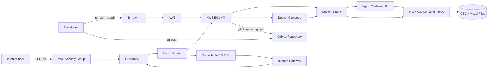

# Patent App Deployment

This project deploys a Dockerized Flask-based patent application to an AWS EC2 virtual machine provisioned entirely with Terraform.

## How It Is Exposed To The Internet

The application is exposed publicly through:

1. A custom AWS VPC created with Terraform
2. A public subnet connected to an internet gateway
3. A route table that sends internet traffic through that gateway
4. An EC2 instance with a public IP inside the public subnet
5. An AWS security group that allows inbound traffic on port `80`
6. An Nginx container listening on port `80`
7. Nginx forwarding requests to the Flask app container on port `8000`

That means users access:

`http://<ec2-public-ip>`

## Architecture



## Folder Structure

```text
pervasive project/
├── app.py
├── Dockerfile
├── requirements.txt
├── mobile_addiction_data.csv
├── stress_model.pkl
├── templates/
├── static/
├── deploy/
│   ├── docker-compose.yml
│   └── nginx/
│       └── default.conf
├── infra/
│   └── terraform/
│       ├── main.tf
│       ├── outputs.tf
│       ├── terraform.tfvars.example
│       ├── user_data.sh.tftpl
│       ├── variables.tf
│       └── versions.tf
└── docs/
    ├── DEPLOY_AWS_TERRAFORM.md
    ├── HOW_TO_GET_3_HISTORICAL_READINGS.md
    ├── INTELLIGENT_ALERT_SYSTEM.md
    ├── RUN_LOCALHOST.md
    └── STRESS_TRAJECTORY_EXPLANATION.md
```

## Local Docker Run

```bash
docker compose -f deploy/docker-compose.yml up --build
```

Then open:

`http://localhost`
