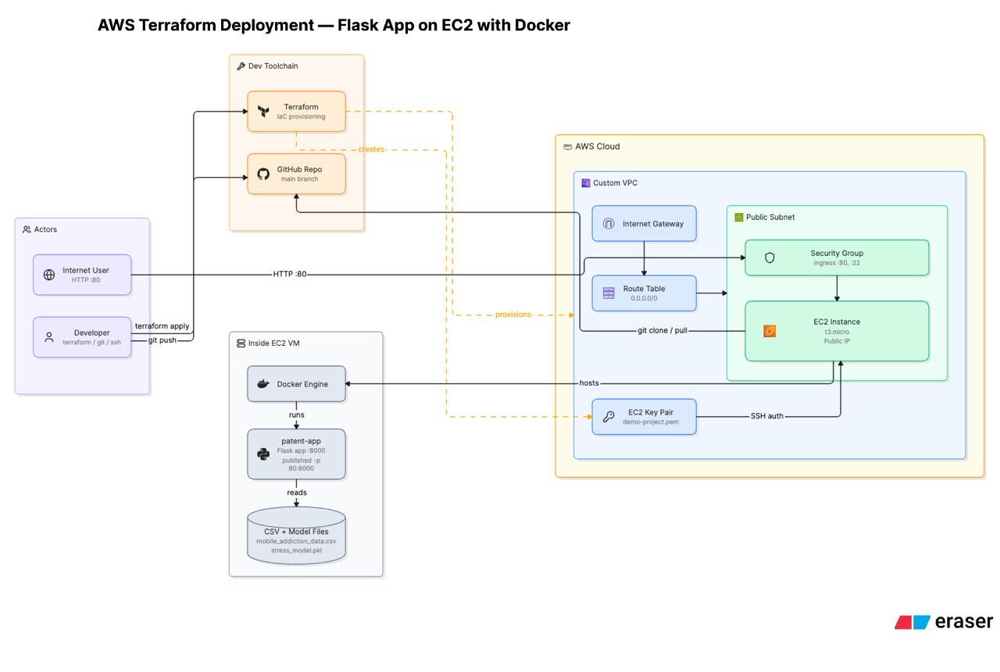

# Smartphone Stress Predictor — AWS Deployment


A Dockerized Flask application that predicts smartphone-addiction-related stress from behavioral data, deployed to AWS EC2 through fully automated Infrastructure as Code (Terraform).

**Live Deployment:** `http://13.206.83.198`

---

## Table of Contents

- [Overview](#overview)
- [How the Application Is Exposed to the Internet](#how-the-application-is-exposed-to-the-internet)
- [Architecture](#architecture)
- [Infrastructure Components (Terraform)](#infrastructure-components-terraform)
- [Application Features](#application-features)
- [Folder Structure](#folder-structure)
- [Deploying to AWS](#deploying-to-aws)
- [Running Locally with Docker](#running-locally-with-docker)
- [Running Locally without Docker](#running-locally-without-docker)
- [Troubleshooting](#troubleshooting)
- [Tech Stack](#tech-stack)
- [Contributing](#contributing)
- [Author](#-author)
- [License](#-license)

---

## Overview

This repository contains:

- A **Flask web application** (`app.py`) that trains a Random Forest model on smartphone usage data, predicts a user's stress level, tracks a rolling stress trajectory, raises intelligent usage alerts, and generates downloadable PDF reports.
- A **Dockerfile** that packages the application and its dependencies into a single container image.
- **Terraform configuration** (`infra/terraform/`) that provisions the complete AWS network and compute stack from scratch — VPC, subnet, routing, security group, SSH key pair, and EC2 instance — and bootstraps the application on first boot.

The result is a one-command deployment: `terraform apply` builds the cloud infrastructure, and the EC2 instance builds and runs the application container automatically.

---

## How the Application Is Exposed to the Internet

1. **Terraform** provisions a custom AWS VPC dedicated to this project.
2. A **public subnet** inside the VPC is attached to an **Internet Gateway**.
3. A **route table** (`0.0.0.0/0`) directs outbound/inbound internet traffic through that gateway to the subnet.
4. An **EC2 instance** (`t3.micro`) with a public IP is launched inside the public subnet.
5. A **security group** allows inbound traffic on port `80` (HTTP) and port `22` (SSH).
6. Terraform generates an **EC2 key pair** (`demo-project.pem`) used to SSH into the instance for management/debugging.
7. On first boot, the instance's user-data script installs Docker, clones this GitHub repository, builds the Docker image, and runs the container directly, publishing container port `8000` to host port `80` (`docker run -p 80:8000`).

End users simply browse to:

```
http://<ec2-public-ip>
```

which today resolves to:

```
http://13.206.83.198
```

---

## Architecture



**In plain terms:** the developer pushes code to GitHub and runs `terraform apply`; Terraform provisions the VPC, subnet, route table, internet gateway, security group, EC2 key pair, and EC2 instance. The instance clones the repository, and Docker Engine runs the `patent-app` Flask container (published on port `80:8000`), which reads `mobile_addiction_data.csv` and `stress_model.pkl`. Internet users reach the app over `HTTP :80` through the security group, and the developer can SSH in using the generated key pair for maintenance.

---

## Infrastructure Components (Terraform)

| Resource | Purpose |
|---|---|
| `aws_vpc.app` | Dedicated custom VPC (`10.0.0.0/16`) for network isolation |
| `aws_internet_gateway.app` | Provides internet connectivity for the VPC |
| `aws_subnet.public` | Public subnet (`10.0.1.0/24`) with auto-assigned public IPs |
| `aws_route_table.public` + association | Routes all outbound traffic (`0.0.0.0/0`) via the Internet Gateway |
| `aws_security_group.app` | Allows inbound `80` (HTTP) and `22` (SSH); open egress |
| `tls_private_key` / `aws_key_pair.app` | Generates and registers an SSH key pair for the instance |
| `local_sensitive_file.ssh_private_key` | Writes the generated private key locally as `demo-project.pem` |
| `aws_instance.app` | `t3.micro` EC2 instance (Amazon Linux 2023) running the application |

The EC2 instance is bootstrapped via a `user_data` script (`user_data.sh.tftpl`) that:

1. Updates the OS and installs Docker and Git.
2. Grows the root filesystem to use the full allocated volume.
3. Clones this repository (`app_repo_url` / `app_branch` variables).
4. Builds the Docker image (`docker build -t patent-app .`).
5. Runs the container (`docker run -d --name patent-app --restart unless-stopped -p 80:8000 patent-app`).

---

## Application Features

- **Stress Prediction** — a Random Forest classifier/regressor predicts a user's stress category and score from smartphone usage behavior.
- **Stress Trajectory** — a 7-day sliding window tracks each user's historical stress scores to visualize trends over time.
- **Intelligent Alert Engine** — cooldown-based alerting (30-minute cooldown, 7-minute display window) prevents alert spam while surfacing meaningful changes in behavior.
- **PDF Report Export** — users can download a generated PDF summary of their prediction and stress history.
- **Interactive Dashboard** — a Bootstrap + Chart.js front end (`templates/index.html`) visualizes predictions, confusion matrix, and feature importance.

Key routes exposed by `app.py`:

| Route | Method | Purpose |
|---|---|---|
| `/` | GET | Renders the main dashboard |
| `/predict` | POST | Runs the stress prediction model on submitted input |
| `/add_test_history` | POST | Adds a historical reading to a user's stress trajectory |
| `/download_report` | GET | Generates and returns a PDF report |

---

## Folder Structure

```text
smartphone-stress-predictor/
├── app.py                          # Flask application entry point
├── Dockerfile                      # Application container image definition
├── requirements.txt                # Python dependencies
├── mobile_addiction_data.csv       # Training/usage dataset
├── stress_model.pkl                # Serialized trained model
├── assets/
│   └── aws-terraform-deployment.jpeg  # Architecture diagram used in this README
├── templates/
│   └── index.html                  # Dashboard UI
├── static/
│   ├── confusion_matrix.png
│   └── feature_importance.png
├── deploy/
│   ├── docker-compose.yml          # Local dev stack (app + nginx reverse proxy)
│   └── nginx/
│       └── default.conf
├── infra/
│   └── terraform/
│       ├── main.tf                 # VPC, subnet, routing, SG, key pair, EC2
│       ├── variables.tf            # Configurable inputs (region, sizing, repo, etc.)
│       ├── outputs.tf              # public_ip, application_url, vpc_id, etc.
│       ├── versions.tf             # Provider version constraints
│       ├── user_data.sh.tftpl      # EC2 bootstrap script (Docker build + run)
│       ├── terraform.tfvars        # Environment-specific variable values
│       └── terraform_user_policy.json  # Minimal IAM policy for the Terraform-executing user
└── .gitignore                      # Excludes .terraform/, state files, and the generated .pem key
```

> **Note:** `deploy/docker-compose.yml` and the bundled Nginx config are provided for **local development convenience** only (`docker compose up` proxies port `80` → `8000`). The production AWS deployment provisioned by Terraform runs the Flask container directly on port `80` via `docker run -p 80:8000`, with no reverse proxy in front of it, as shown in the architecture diagram above.

---

## Deploying to AWS

### Prerequisites

- An AWS account with credentials configured (`aws configure` or environment variables)
- [Terraform](https://developer.hashicorp.com/terraform/downloads) `>= 1.5.0`
- This repository pushed to GitHub (Terraform's `user_data` script clones it on boot)

### Steps

```bash
cd infra/terraform

# Review/adjust variables (region, instance size, repo URL, branch, etc.)
cat terraform.tfvars

terraform init
terraform plan
terraform apply
```

On completion, Terraform prints:

```
public_ip        = "<ec2-public-ip>"
application_url  = "http://13.206.83.198"
vpc_id           = "<vpc-id>"
public_subnet_id = "<subnet-id>"
private_key_path = "demo-project.pem"
```

Open `application_url` in a browser to use the deployed application. Use `demo-project.pem` to SSH into the instance for maintenance:

```bash
ssh -i demo-project.pem ec2-user@<ec2-public-ip>
```

### Tearing Down

```bash
terraform destroy
```

---

## Running Locally with Docker

```bash
docker compose -f deploy/docker-compose.yml up --build
```

Then open:

```
http://localhost
```

This local stack runs the Flask app behind an Nginx reverse proxy for parity with typical production web-server setups, independent of how the AWS deployment is configured.

---

## Running Locally without Docker

Prerequisites: Python 3.11, `pip`.

```bash
python -m venv venv
source venv/bin/activate        # Windows: venv\Scripts\activate

pip install -r requirements.txt
python app.py
```

Then open:

```
http://localhost:8000
```

This runs Flask directly on the host without a container or reverse proxy — useful for quick debugging of `app.py` or the model logic.

---

## Troubleshooting

| Symptom | Likely Cause | Fix |
|---|---|---|
| `FileNotFoundError: Dataset not found` | `mobile_addiction_data.csv` missing from the working directory | Ensure the CSV sits alongside `app.py`, or set the `MOBILE_ADDICTION_DATASET` environment variable to its path |
| `Permission denied (publickey)` on SSH | Wrong permissions on the generated key | `chmod 400 demo-project.pem`, then retry the SSH command |
| Browser can't reach `http://<ec2-public-ip>` | Security group not yet applied, or instance still bootstrapping | Wait 1–2 minutes after `terraform apply`; confirm port `80` is open in the security group |
| `docker: port is already allocated` (local run) | Something else on the host is already bound to port `80` | Stop the conflicting process, or change the published port in `deploy/docker-compose.yml` |
| `terraform apply` fails with IAM/auth errors | Executing AWS user lacks required permissions | Attach the policy in `infra/terraform/terraform_user_policy.json` to the IAM user/role running Terraform |
| App loads but `/predict` errors on model load | `stress_model.pkl` missing or incompatible with the installed scikit-learn version | Confirm `stress_model.pkl` is present and `requirements.txt` versions match those used to train it |
| Changes to `user_data.sh.tftpl` don't take effect | EC2 only runs user-data on first boot by default | Terraform is configured with `user_data_replace_on_change = true`, so re-run `terraform apply`; for a running instance you may still need to `terraform taint aws_instance.app` to force replacement |

---

## Tech Stack

- **Backend:** Flask, scikit-learn, pandas, NumPy, imbalanced-learn (SMOTE), SciPy
- **Reporting:** ReportLab (PDF generation), Matplotlib, Seaborn
- **Frontend:** Bootstrap 5, Chart.js, html2canvas, jsPDF
- **Containerization:** Docker
- **Infrastructure as Code:** Terraform (AWS provider `~> 5.0`, TLS `~> 4.0`, Local `~> 2.0`)
- **Cloud:** AWS (VPC, EC2, Internet Gateway, Route Table, Security Group, Key Pair)

---

## Contributing

Contributions are welcome. To propose a change:

1. Fork the repository and create a feature branch.
2. Make your changes, keeping infrastructure changes (`infra/terraform/`) and application changes (`app.py`, `templates/`, `static/`) in separate commits where possible.
3. Test locally with `docker compose -f deploy/docker-compose.yml up --build` before opening a pull request.
4. Open a pull request describing the change and its motivation.

For infrastructure changes, run `terraform plan` and include the output in the pull request description so reviewers can see the exact resources affected before `apply`.

---

## 👩‍💻 Author

**Anu Swathi V. R.**
Integrated M.Tech – Computer Science and Engineering (Data Science)
Vellore Institute of Technology (VIT), Vellore

- GitHub: [https://github.com/AnuSwathi02](https://github.com/AnuSwathi02)
- Project Repository: [https://github.com/AnuSwathi02/smartphone-stress-predictor](https://github.com/AnuSwathi02/smartphone-stress-predictor)

---

## 📄 License

This project is intended for educational purposes and demonstrates cloud deployment using Terraform, Docker, AWS, and Flask.
